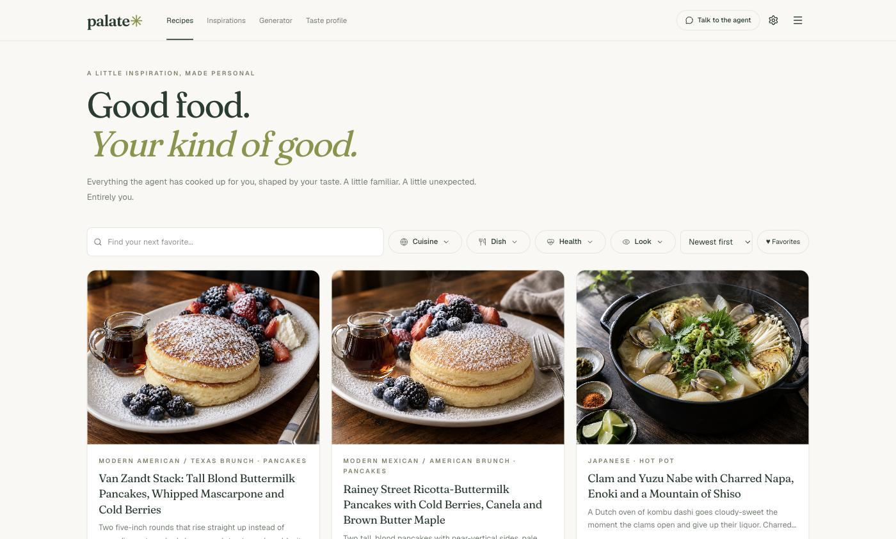
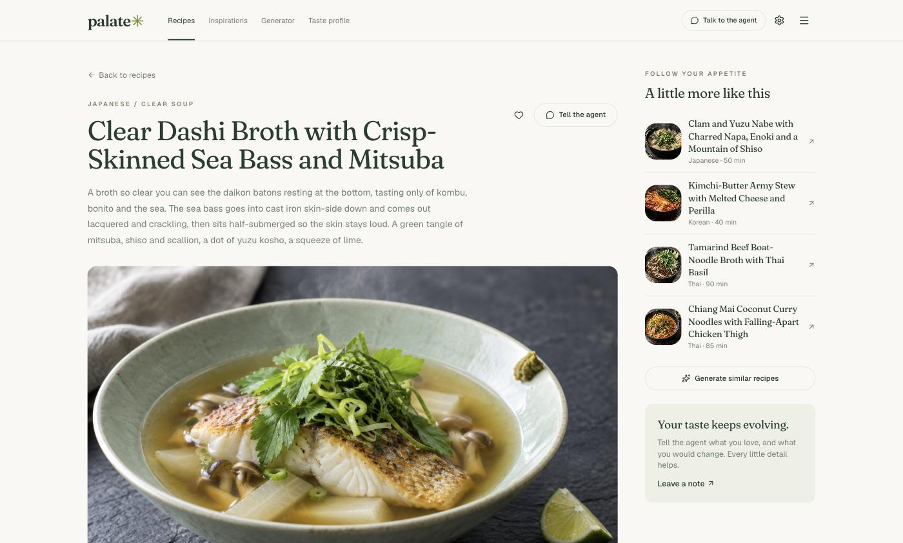
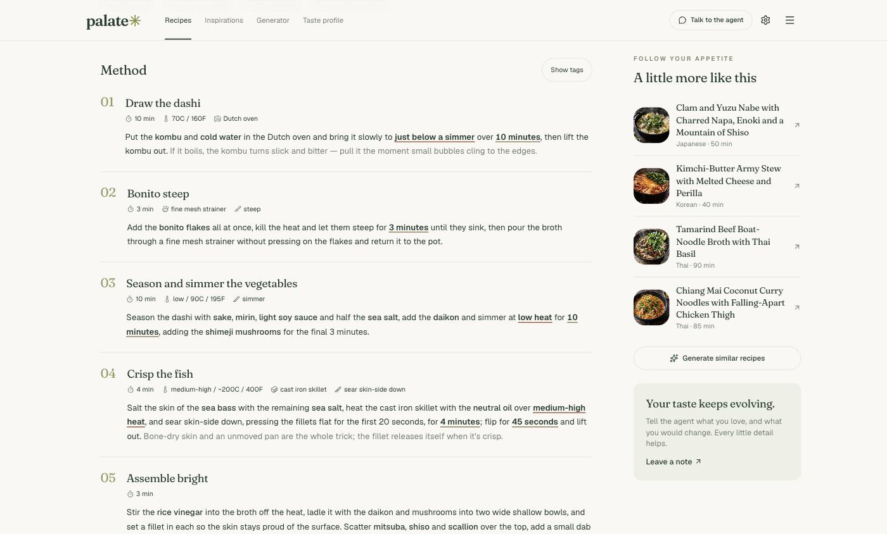
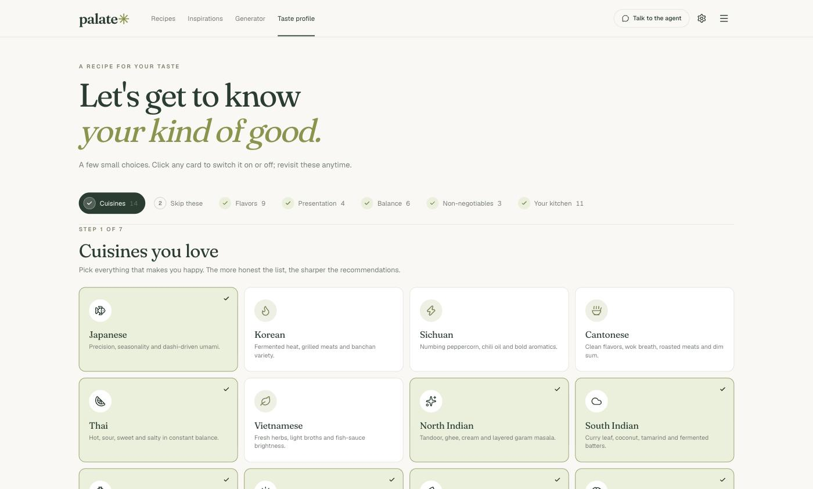
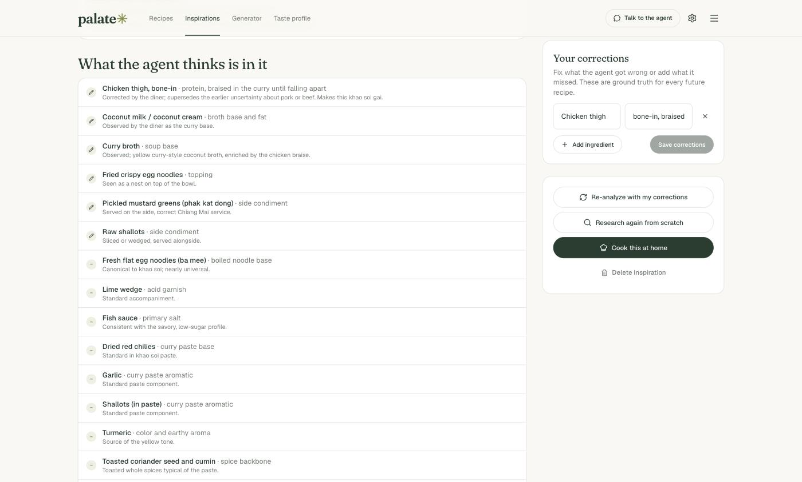

<p align="center">
  
</p>

<h1 align="center">palate✳</h1>

<p align="center">
  A personal recipe recommender that learns your palate.<br>
  It cooks up bespoke recipes on its own schedule, photographs them, illustrates every ingredient,<br>
  researches the restaurant dishes you loved, and gets sharper with every note you leave it.
</p>

<p align="center">
  <a href="#what-it-offers">What it offers</a> ·
  <a href="#how-it-thinks">How it thinks</a> ·
  <a href="#run-it-locally">Run it locally</a> ·
  <a href="#architecture">Architecture</a> ·
  <a href="#design">Design</a>
</p>

---

## What it offers

**A library that grows without being asked.**
On a schedule you set, the agent reads your latest profile, instructions, restaurant inspirations and feedback, then composes a fresh batch of recipes, photographs each dish, and illustrates every new ingredient.
Search the library by keyword, filter by cuisine, dish type, health profile or presentation, and favorite the keepers.

**Recipes you can actually cook from.**
Every recipe carries a poetic summary, the tools you need, scaled ingredients with hand-drawn illustrations, and a method whose steps read as prose.
Under each step a quiet strip shows the time, temperature, equipment and technique at a glance, and a "Show tags" toggle lights up every tagged phrase for people who want the full annotation.

<p align="center">
  
  
</p>

**A taste profile you build by clicking.**
A seven-step wizard covers the cuisines you love and the ones you avoid, the flavor profiles underneath those cuisines (fermented funk, chili heat, bright acidity...), how you like food to look, the health profiles to cover, hard dietary rules, and the cookware you own.
Every card is a toggle, every click saves instantly, and you can come back and revise any step at any time.

<p align="center">
  
</p>

**Restaurant dishes, reverse-engineered.**
Add a dish you loved out, with the restaurant, the city and a photo if you have one.
The agent searches the web for the restaurant and its menu, reads the photo, and produces an ingredient list where every line is labeled verified, inferred or "you said so", with sources.
Correct anything it got wrong, re-analyze with your corrections as ground truth, then press "Cook this at home" to get a recipe built for your own stove.

<p align="center">
  
</p>

**Groups, with one shopping list.**
Gather recipes for an occasion ("Thanksgiving", "a week of lunches") from any recipe's "Add to group" button.
Each group consolidates the ingredients of its recipes into a single checklist, combining quantities when the ingredient and unit match and naming which recipes need each line.
Every recipe also has its own ingredient checklist for the shop.

**An agent you can talk to.**
A drawer slides in from any recipe card or detail page.
Tell the agent an absolute truth ("I am allergic to walnuts") that it must never break, or a preference ("lately I want brothy dinners") that cascades, with newer preferences winning over older ones.
Rate any recipe, say why, and the next batch responds to it.

**More of what you like, on demand.**
Describe a craving in the generator and keep only the drafts you want.
On any recipe, ask for more like it and choose what "similar" means: ingredients, taste, presentation, cuisine or dish type.
Every run is logged with its status, what it produced, and the exact prompt the agent was shown.

## How it thinks

Before every run the agent is shown the whole picture: active profile selections, absolute truths, cascading preferences (newest first), inspirations with researched and corrected ingredients, favorites and ratings with your notes, the cookware you own, and recent titles to avoid repeating.
Generation is one structured call to Claude; a deterministic guard and a second low-effort review pass check the batch against your hard constraints, and one repair round fixes anything that slipped.
Only then are photos and ingredient illustrations rendered, in the background, while the recipes are already readable in the library.

The models behind it: Claude (`claude-opus-5`) for recipe composition, web research and reading photos; OpenAI `gpt-image-2.5` for food photography and the watercolor ingredient illustrations, which are cached forever per ingredient.

## Run it locally

Requires Node 20.9+ (`.nvmrc` pins 20.20.2), Docker (for the local Supabase stack), an Anthropic API key, and an OpenAI API key.

```sh
npm ci
cp .env.example .env.local        # fill in ANTHROPIC_API_KEY and OPENAI_API_KEY
npx supabase start -x edge-runtime,realtime,mailpit,logflare,vector
```

`supabase start` prints the local API URL and service role key; put them in `.env.local` as `SUPABASE_URL` and `SUPABASE_SERVICE_ROLE_KEY`.
The migration in `supabase/migrations/` runs automatically and creates every table, the task-queue claim function and the storage buckets.

```sh
npm run dev
```

Open the app, walk through the taste profile, then open Settings and press "Run now" for a first batch.
Generation takes a couple of minutes; photos and illustrations trickle in behind it.
A development heartbeat pokes the background worker every 30 seconds so nothing needs a cron locally.

Validation:

```sh
npm run typecheck
npm run lint
npm test
npm run build
```

Tests cover the pure logic (context assembly and the cascade rule, similarity scoring, scheduling, the step facts strip).
UI behavior is verified in the browser.

## Deploy

The app runs on Vercel against a hosted Supabase project.
`npx supabase link --project-ref <ref>` then `npx supabase db push` applies the migrations (tables, queue function, buckets, and the `pg_cron` heartbeat that pokes the worker every minute).
Set these in the Vercel project: `SUPABASE_URL`, `SUPABASE_SERVICE_ROLE_KEY`, `ANTHROPIC_API_KEY`, `OPENAI_API_KEY`, `APP_PASSWORD`, `SESSION_SECRET`, `WORKER_SECRET`, `CRON_SECRET`.
After the first deploy, store the site URL and `WORKER_SECRET` in Supabase Vault as `palate_worker_url` and `palate_worker_secret` so the heartbeat can reach the worker.
`vercel.json` schedules `/api/cron/recommend` daily; the app decides whether a run is due from your settings.
`scripts/copy-storage.mjs` copies the local storage buckets to the hosted project when moving an existing library.

## Architecture

```
browser ("use client" components)
   |  fetch("/api/...")
   v
app/api/*/route.ts        thin handlers: validate with zod, call lib/db, return JSON
   |
   v
lib/db.ts                 the ONLY module that touches Supabase (Postgres + Storage)
lib/ai/*                  Claude calls (generation, review, research, re-analysis) and OpenAI images
lib/jobs/*                Postgres task queue drained by POST /api/worker in bounded slices
```

- `lib/config.ts` is the only reader of `process.env`.
- `lib/schemas.ts` defines every shape that crosses a boundary (model output, API input, jsonb columns); `lib/types.ts` infers types from it.
- `lib/catalog/` is the preference vocabulary shown by the wizard and sent to the model.
- `lib/icons.ts` is the iconography taxonomy: step segments, equipment, ingredients, filter groups and options.
- `proxy.ts` is a single-owner password gate (`APP_PASSWORD`); the worker and cron endpoints use bearer secrets instead.

### Background work

Recipe generation with imagery takes minutes, longer than one serverless invocation.
Work is split into small tasks in the `tasks` table and claimed with `FOR UPDATE SKIP LOCKED` by `POST /api/worker`, which drains for a bounded slice and re-triggers itself while work remains.
Interactive tasks (generation, research) are claimed ahead of bulk rendering so a new request never waits behind fifty illustrations.
`GET /api/cron/recommend` decides whether an autonomous run is due from the latest settings and enqueues it; in production a Vercel Cron and a Supabase `pg_cron` heartbeat drive it, locally `instrumentation.ts` does.

### Data

Postgres tables: `settings`, `profile_selections`, `instructions`, `inspirations`, `runs`, `recipes`, `recipe_images`, `ingredient_art`, `tasks`, `groups`, `group_recipes`.
Storage buckets: `recipe-images` and `ingredient-art` (public read), `inspiration-photos` (private, signed URLs; the browser uploads straight to storage).
Single personal workspace: every table carries `user_id` so per-user auth later is a data migration, and the migration documents the RLS steps.

Locally the database and storage live in Docker volumes (`supabase_db_<project>`, `supabase_storage_<project>`), which survive `supabase stop` and reboots; only `supabase db reset` wipes them.
`npm run db:backup` writes a SQL dump to `backups/` (git-ignored); the script header explains how to archive the storage volume too.
Pointing `SUPABASE_URL` and `SUPABASE_SERVICE_ROLE_KEY` at a hosted Supabase project moves everything off the laptop with no code change.

## Design

The look is documented in `docs/design/design-system.md` (tokens, type, components, motion) and the usability rules that shaped the density in `docs/design/usability-guardrails.md`.
Ivory paper, forest-green ink, olive as the only accent, a serif display with one italic phrase per page, flat cards that lift on hover.

## Status

`docs/STATUS.md` records what is built, what has been verified with real runs, and what is next.
